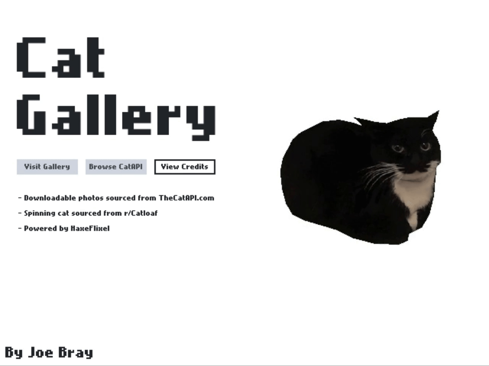

A simple app that stores and displays photos and information about cats.
Photos are downloaded within the app from [TheCatAPI](https://thecatapi.com/).

This is a practice project I challenged myself with to improve my work efficiency, 
and my skills with HaxeFlixel, reactive UI, and API requests.

Unfortunately, I cannot distribute an executable version, but the instructions to build it yourself are simple (and listed below).

## Building
If you want to build your own copy or even create your own version, the steps are simple:

- __First__: [Download](https://github.com/JBB248/CatGallery/archive/refs/heads/main.zip) the source code or [clone](https://docs.github.com/en/repositories/creating-and-managing-repositories/cloning-a-repository) this repository (the latter requires [git](https://git-scm.com/))

- __Second__: Download and install [Haxe](https://haxe.org)

- __Third__: Follow the instructions to [install HaxeFlixel](https://haxeflixel.com/documentation/getting-started/)

- __Fourth__: If you aren't going to use Neko, you'll need to set lime up for your OS
    - Windows: [Setup Windows](https://lime.openfl.org/docs/advanced-setup/windows/)
    - MacOS: [Setup MacOS](https://lime.openfl.org/docs/advanced-setup/macos/)
    - Linux: [Setup Linux](https://lime.openfl.org/docs/advanced-setup/linux/)

- __Fifth__: While this project will work without an api key to [TheCatAPI](https://thecatapi.com/), it won't be nearly as cool. 
    - If you're okay _without_ a key, just disable the `USE_API` flag on `project.xml` by commenting out or deleting the line
    ```xml
    <define name="USE_API">
    ```
    - If you do want to use a key, you must first get one from [here](https://thecatapi.com/#pricing). Then make a new file called `env.xml`. Inside it, paste the following code, replacing `YOUR_KEY_HERE` with the key you recieved from TheCatAPI in an email: 
    ```xml
    <?xml version="1.0" encoding="utf-8"?>
    <project>
        <setenv name="CAT_API_KEY" value="YOUR_KEY_HERE"/>
    </project>
    ```
        
    
    > ___WARNING:___ Make sure you do not accidentally reveal your API key! Someone can abuse it without you knowing! TheCatAPI is pretty lenient with theirs, but it still should be avoided at all costs!

### Note:
This is built with Neko and Windows in mind.
I do not have the means to test on Mac or Linux, so those builds may not function as expected.
Html5 definitely doesn't work :sweat_smile:

If you have any questions, leave them in the discussions tab.

## Credits
- Downloadable photos are sourced from [TheCatAPI](https://thecatapi.com/)
- Spinning cat sourced from [r/Catloaf](https://www.reddit.com/r/Catloaf/comments/yrvghr/found_it_the_very_rare_3d_360_degrees_catloaf/)
- Powered by [HaxeFlixel](https://haxeflixel.com)
